# LAB07 — Nexo: películas, noticias y laboratorio ORM con IA

Proyecto del curso con tres aplicaciones: `movies`, del laboratorio de administración de películas; `news`, su continuación con un portal de noticias y Django Templates; y `blog`, el laboratorio extra de la semana 7 sobre ORM con IA.

Repositorio de entrega: [leonel-m4/Desarrollo-de-Aplicaciones-Empresariales-LAB07](https://github.com/leonel-m4/Desarrollo-de-Aplicaciones-Empresariales-LAB07).

- [Proyecto fusionado: instalación y alcance](#proyecto-fusionado-instalación-y-alcance).
- [Guía del laboratorio ORM con IA](docs/orm-con-ia.md).
- [Laboratorio de películas](#objetivo-del-laboratorio).
- [Continuación: portal de noticias](#continuación-portal-de-noticias).
- [Capturas del portal de noticias](#capturas-del-portal-de-noticias).

## Proyecto fusionado: instalación y alcance

La aplicación `blog` procede de `dae-s07-orm-con-ia` y ahora funciona dentro de este proyecto, sin depender de la carpeta original. Se comparte un único `manage.py`, la configuración `config`, el entorno virtual, la base SQLite y el administrador. El proyecto original se conserva intacto.

Las tres aplicaciones mantienen sus modelos y migraciones separados. En particular, los autores y categorías de `blog` no se mezclan con los de `news`: sus relaciones y objetivos son diferentes. Se conservan los comandos `seed_blog`, `duel` y `agent`, además de los comandos de películas y noticias. Las dependencias existentes de LAB05 ya son compatibles con el laboratorio ORM.

### Inicio rápido en Windows

Desde esta carpeta, en PowerShell y con Python 3.13 o superior instalado:

```powershell
py -m venv .venv
.\.venv\Scripts\python.exe -m pip install -r requirements.txt
.\.venv\Scripts\python.exe manage.py migrate
```

Solo para preparar **una base nueva** con los ejemplos de las tres aplicaciones:

```powershell
.\.venv\Scripts\python.exe manage.py seed_lab
.\.venv\Scripts\python.exe manage.py seed_news
.\.venv\Scripts\python.exe manage.py seed_blog
.\.venv\Scripts\python.exe manage.py runserver
```

**Precaución:** `seed_lab` reemplaza las películas y valoraciones existentes; `seed_blog` reemplaza todos los datos del blog. No los ejecutes sobre contenido que quieras conservar. `seed_news` conserva las ediciones de sus noticias ya cargadas. Ninguno de estos comandos importa una base de datos del otro repositorio.

El inicio está en `http://127.0.0.1:8000/`, las noticias en `/noticias/`, el laboratorio en `/blog/` y el administrador de las tres aplicaciones en `/admin/`.

### Ejercicios conservados y verificación

Las funciones **q1–q4** de `blog/duel/team.py` se reservan para el trabajo individual sin IA. **q5–q8** se implementaron con asistencia declarada en [el entregable](entregable/LAB07.md); cada una devuelve un QuerySet y se valida con una consulta. Las respuestas de `blog/duel/ai_answers.py` mantienen sus errores de práctica y la portada todavía conserva el problema N+1 en `blog/queries.py`. Las acciones de IA solo se ejecutan desde la consola, no desde la página pública.

```powershell
.\.venv\Scripts\python.exe manage.py check
.\.venv\Scripts\python.exe manage.py makemigrations --check --dry-run
.\.venv\Scripts\python.exe manage.py test --verbosity 2
```

Hay **49 pruebas definidas**: 18 de películas y noticias, 24 del laboratorio ORM y 7 de integración. En la plantilla inicial, la suite completa tiene **un fallo intencional**, `test_front_page_runs_two_queries`, y dos pruebas omitidas porque no se incluye la carpeta privada `teacher/`. Ese fallo se conserva como parte del ejercicio, no es una regresión de la fusión.

La verificación de la fusión obtuvo **46 pruebas correctas, 2 omitidas y ese único fallo de práctica**: la portada ejecuta 23 consultas frente a las 2 esperadas. `check`, la comprobación de migraciones pendientes y `makemigrations --check --dry-run` no encontraron problemas. Se comprobaron por HTTP las tres secciones, categorías, detalles, recomendaciones, acceso al administrador y CSS del blog. El HTML del blog se probó en viewports de 1440, 390 y 320 píxeles, y el inicio a 320 píxeles, sin desbordamiento horizontal y con los cuatro enlaces de navegación visibles.

Para comprobar la fusión y el resto de funcionalidades sin ejecutar el ejercicio de rendimiento pendiente:

```powershell
.\.venv\Scripts\python.exe manage.py test movies news blog.tests.test_integration blog.tests.test_seed blog.tests.test_duel blog.tests.test_agent --verbosity 2
```

Las pruebas de integración verifican la navegación compartida, el administrador de las tres aplicaciones, los comandos, el escapado del contenido y que reiniciar el blog no borre películas, noticias ni usuarios. Consulta [la guía del laboratorio](docs/orm-con-ia.md) para completar los retos.

## Organización de Nexo

Nexo reúne cine, noticias y el laboratorio ORM bajo una misma identidad. Cada página tiene una función distinta:

| Sección | Dirección | Función |
| --- | --- | --- |
| Inicio | `/` | Portada común: una noticia destacada, una película valorada y selecciones breves de ambas secciones. |
| Películas | `/catalogo/` | Catálogo completo por género, con puntuaciones sobre 5 y acceso a recomendaciones. |
| Recomendaciones | `/peliculas/<id>/recomendaciones/` | Película de referencia y otras del mismo género, ordenadas por valoración. |
| Noticias | `/noticias/` | Todas las publicaciones, ordenadas por fecha de su fuente original. |
| Categoría | `/noticias/categoria/<slug>/` | Noticias que pertenecen a la sección seleccionada. |
| Detalle | `/noticias/articulo/<slug>/` | Lectura del artículo, imagen, autor, fecha, créditos, fuente y noticias relacionadas. |
| Blog ORM | `/blog/` | Artículos y retos del laboratorio ORM con IA, independientes de las noticias. |
| Admin | `/admin/` | Gestión de películas, noticias y blog desde el mismo administrador. |

La navegación principal es **Inicio → Películas → Noticias → Blog ORM**, visible también en móvil. **Admin** se presenta como acceso secundario. El logo vuelve a Inicio. Las páginas interiores muestran una ruta de navegación y los detalles permiten regresar a su sección, en lugar de enviar siempre a la portada.

El inicio no repite el catálogo completo: muestra cuatro películas adicionales y tres noticias adicionales, excluyendo los destacados de esas selecciones. Las cifras y las selecciones proceden de la base de datos. No hay buscadores ni notificaciones decorativos.

### Componentes y criterios visuales

- `templates/base.html`: estructura, recursos estáticos, navegación y pie comunes.
- `templates/components/movie_card.html`: tarjeta compartida por Inicio, Películas y Recomendaciones.
- `templates/components/breadcrumbs.html`: ubicación dentro del sitio.
- `templates/news/_article_card.html`: tarjeta compartida por Inicio, Noticias y Categoría, con variante destacada.
- `templates/news/_related_articles.html`: otras noticias de la misma categoría, excluyendo la noticia abierta.
- `movies/static/site/css/site.css`: estilos globales, navegación responsive, tarjetas de cine y composición del inicio.
- `news/static/news/css/style.css`: estilos de noticias limitados a `.news-portal`.
- `blog/templates/blog/front_page.html`: portada del laboratorio, heredada de la base común.
- `blog/static/blog/css/style.css`: estilos del laboratorio limitados a `.orm-lab`.

Los pósters conservan su proporción, las tarjetas separan imagen e información y los botones permanecen visibles sin depender del hover. Las animaciones son discretas y respetan la preferencia de movimiento reducido. La vista de lectura conserva la imagen completa y coloca sus créditos debajo; la fuente original queda al final del cuerpo.

### Referencias de UX consultadas

- [Nielsen Norman Group — Homepage Design: 5 Fundamental Principles](https://www.nngroup.com/articles/homepage-design-principles/): portada con propósito claro, ejemplos representativos y enlaces descriptivos.
- [GOV.UK Design System — Breadcrumbs](https://design-system.service.gov.uk/components/breadcrumbs/): orientación en páginas interiores.
- [GOV.UK Design System — Header](https://design-system.service.gov.uk/components/header/): cabecera coherente entre secciones. Se utiliza la identidad propia de Nexo.

### Verificación de la organización

```powershell
python manage.py test movies news --verbosity 2
```

Películas y noticias conservan **18 pruebas**: cuatro para navegación, selección del inicio, catálogo y recomendaciones; catorce para el portal de noticias. Antes de la fusión también se verificaron sus seis páginas principales en Chromium a 1440, 1024, 768, 390 y 320 píxeles, sin desbordamiento horizontal y con la navegación accesible. La suite del proyecto fusionado y su fallo de práctica se describen en [Ejercicios conservados y verificación](#ejercicios-conservados-y-verificación).

## Objetivo del laboratorio

Configurar el administrador de Django para gestionar modelos relacionados, personalizar listados, filtros y busquedas, administrar accesos con usuarios y grupos, y crear una vista publica de recomendacion para comparar el uso del panel con una vista propia.

## Checklist del laboratorio

1. Proyecto Django creado con la estructura del curso, dependencia `Pillow` declarada en `requirements.txt` y aplicacion `movies` agregada en `INSTALLED_APPS`.
2. Modelos `Movie`, `Genre`, `Person` y `Rating` declarados con campos, `Meta` y `__str__`.
3. Relacion muchos a muchos entre peliculas y generos mediante `Movie.genres`.
4. Relacion de clave foranea entre valoraciones y peliculas mediante `Rating.movie`.
5. Migraciones generadas en `movies/migrations/0001_initial.py` y aplicadas con `python manage.py migrate`.
6. Superusuario creado por el comando `python manage.py seed_lab`.
7. Los cuatro modelos estan registrados en `movies/admin.py`.
8. El administrador fue personalizado con clases `ModelAdmin`, `list_display`, `list_filter` y `search_fields`.
9. Las valoraciones aparecen como bloque en linea dentro del formulario de pelicula mediante `RatingInline`.
10. Los campos de auditoria `created_at` y `updated_at` estan marcados como solo lectura.
11. El grupo `editores` y el usuario `editor` se crean con permisos para agregar y cambiar peliculas, sin permiso para eliminarlas.
12. La vista publica de recomendacion esta disponible en `/peliculas/<id>/recomendaciones/`.

## Estructura principal

- `config/`: configuracion general del proyecto Django.
- `movies/`: aplicacion principal del laboratorio.
- `news/`: portal de noticias.
- `blog/`: laboratorio ORM con IA, sus modelos, consultas, comandos y pruebas.
- `docs/orm-con-ia.md`: guía de los ejercicios de la semana 7 dentro de Nexo.
- `movies/models.py`: modelos `Movie`, `Genre`, `Person` y `Rating`.
- `movies/admin.py`: personalizacion del panel de administracion.
- `movies/views.py`: vista publica de recomendaciones.
- `templates/base.html`: layout común de películas y noticias con Tailwind CSS.
- `movies/templates/components/`: componentes reutilizables de navbar y mensajes.
- `movies/management/commands/seed_lab.py`: comando para crear datos, usuarios y permisos de prueba.
- `requirements.txt`: dependencias del proyecto.

## Requisitos

- Python 3.13 o superior
- pip

## Instalacion

Crear y activar un entorno virtual:

```powershell
python -m venv .venv
.\.venv\Scripts\Activate.ps1
```

Instalar dependencias:

```powershell
python -m pip install -r requirements.txt
```

## Preparar la base de datos

Aplicar migraciones:

```powershell
python manage.py migrate
```

Cargar datos de prueba, superusuario, grupo `editores` y usuario editor:

```powershell
python manage.py seed_lab
```

Credenciales creadas por el comando:

- Superusuario: `admin` / `Admin12345`
- Editor: `editor` / `Editor12345`

## Ejecutar el proyecto

Iniciar el servidor de desarrollo:

```powershell
python manage.py runserver
```

Abrir en el navegador:

- Inicio de Nexo: `http://127.0.0.1:8000/`
- Catalogo completo: `http://127.0.0.1:8000/catalogo/`
- Panel de administracion: `http://127.0.0.1:8000/admin/`
- Recomendaciones: abrir una película desde el catálogo; la ruta es `/peliculas/<id>/recomendaciones/`.

## Modelos implementados

- `Genre`: nombre del genero y campos de auditoria.
- `Person`: nombre, biografia, fecha de nacimiento y campos de auditoria.
- `Movie`: titulo, sinopsis, anio de estreno, afiche local, URL de afiche externo, generos, director, reparto y campos de auditoria.
- `Rating`: pelicula relacionada, puntuacion, comentario y campos de auditoria.

Relaciones principales:

- Una pelicula puede tener varios generos mediante una relacion muchos a muchos.
- Una pelicula puede tener varias valoraciones mediante una clave foranea desde `Rating`.
- Una pelicula puede tener un director y varias personas en el reparto.

## Administrador de Django

Los cuatro modelos estan registrados en el panel de administracion:

- `Genre`
- `Person`
- `Movie`
- `Rating`

Personalizaciones aplicadas:

- `list_display` muestra columnas utiles como titulo, anio, director, promedio de valoraciones y fechas de auditoria.
- `list_filter` permite filtrar peliculas y valoraciones por genero y anio.
- `search_fields` permite buscar por titulo de pelicula y nombre de personas.
- Las valoraciones se administran en linea dentro del formulario de cada pelicula.
- Los campos `created_at` y `updated_at` son de solo lectura en el panel.
- `filter_horizontal` facilita seleccionar generos y reparto en peliculas.

## Usuarios, grupos y permisos

El comando `python manage.py seed_lab` crea:

- Superusuario `admin` con acceso completo al panel.
- Grupo `editores` con permisos para agregar y cambiar peliculas.
- Usuario `editor` dentro del grupo `editores`.

Comparacion esperada en el panel:

- El superusuario puede ver y administrar todos los modelos y operaciones.
- El editor puede entrar al panel y trabajar con peliculas segun sus permisos.
- El editor no tiene permiso para eliminar peliculas.

## Datos de prueba

Para preparar rapidamente el laboratorio, el comando `seed_lab` carga:

- 10 peliculas reales, distribuidas en 4 generos.
- 4 generos.
- Personas para directores y reparto.
- Valoraciones en las peliculas para probar recomendaciones por promedio.
- Posters externos en alta resolucion usando URLs publicas de TMDb.

Esto permite probar filtros, busquedas, listados, valoraciones en linea y la vista publica de recomendaciones.

Si se desea cumplir el flujo manual indicado en la sesion, los mismos datos pueden cargarse desde el panel en `http://127.0.0.1:8000/admin/`, entrando con el superusuario y usando las secciones `Genres`, `People`, `Movies` y `Ratings`.

## Vista publica de recomendacion

La pagina principal esta en:

```text
http://127.0.0.1:8000/
```

El catalogo completo por generos esta en:

```text
http://127.0.0.1:8000/catalogo/
```

Desde el catalogo se muestran las peliculas agrupadas por genero en grillas responsivas, con animacion al pasar el cursor y un boton para abrir recomendaciones de la misma categoria.

## Interfaz visual

- La interfaz publica usa Tailwind CSS por CDN, Lucide Icons y hojas de estilo locales compartidas.
- El layout esta organizado con navbar superior, breadcrumbs, cards premium y estados vacios.
- La pagina principal presenta cine y noticias; el catalogo completo se encuentra en la seccion Peliculas.
- Las peliculas tienen microinteracciones al pasar el cursor y se organizan por genero.
- La pagina de recomendaciones mantiene la misma identidad visual y conserva la logica original de Django.

Ruta:

```text
/peliculas/<id>/recomendaciones/
```

Ejemplo:

```text
http://127.0.0.1:8000/peliculas/1/recomendaciones/
```

La vista busca peliculas del mismo genero que la pelicula seleccionada y las ordena por mejor promedio de valoraciones.

Esta vista demuestra que el panel de administracion sirve para gestionar datos, pero una vista propia es necesaria cuando se quiere presentar una funcionalidad publica con una regla especifica de negocio.

## Capturas para el entregable

El enunciado pide registrar capturas del panel antes y despues de la personalizacion, ademas de comparar lo que ve el superusuario frente al usuario editor. Para el entregable del campus virtual, incluir estas capturas:

1. `01_admin_modelos.png`: panel `/admin/` con los cuatro modelos visibles: `Genres`, `People`, `Movies` y `Ratings`.
2. `02_admin_peliculas_listado.png`: listado de peliculas mostrando columnas utiles, filtros por genero/anio y buscador.
3. `03_admin_pelicula_formulario.png`: formulario de una pelicula mostrando los campos principales, generos y reparto.
4. `04_admin_valoraciones_inline.png`: formulario de pelicula mostrando las valoraciones en linea dentro del registro padre.
5. `05_admin_auditoria_readonly.png`: campos `fecha de creacion` y `ultima modificacion` visibles como solo lectura.
6. `06_editor_panel.png`: vista del panel entrando con `editor`, mostrando acceso limitado por el grupo `editores`.
7. `07_editor_sin_eliminar.png`: comprobacion de que el usuario editor puede agregar/cambiar peliculas, pero no eliminar.
8. `08_vista_publica_inicio.png`: pagina publica principal `http://127.0.0.1:8000/`.
9. `09_vista_publica_recomendaciones.png`: vista publica `/peliculas/<id>/recomendaciones/` con peliculas del mismo genero mejor valoradas.
10. `10_vista_publica_catalogo.png`: catalogo completo `http://127.0.0.1:8000/catalogo/` con peliculas agrupadas por genero.

### Capturas incluidas

#### 01. Modelos registrados en admin

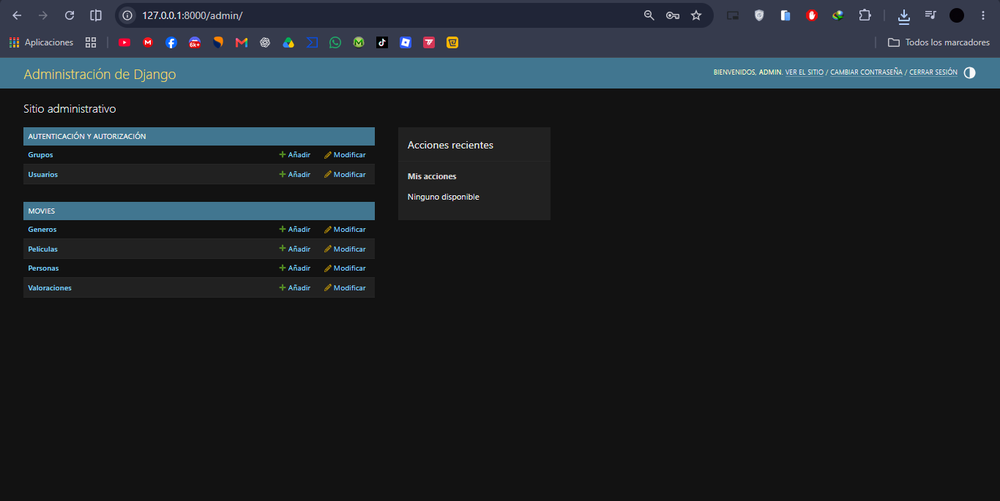

#### 02. Listado de peliculas personalizado

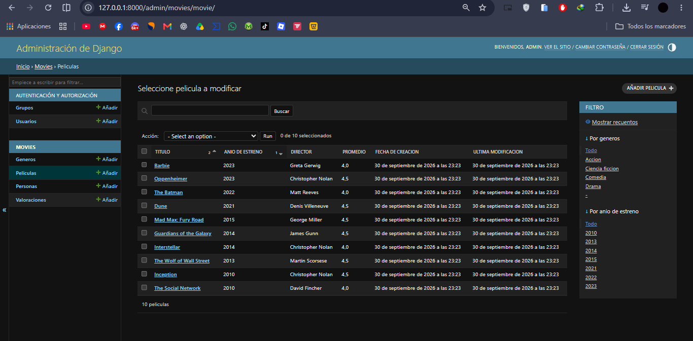

#### 03. Formulario de pelicula

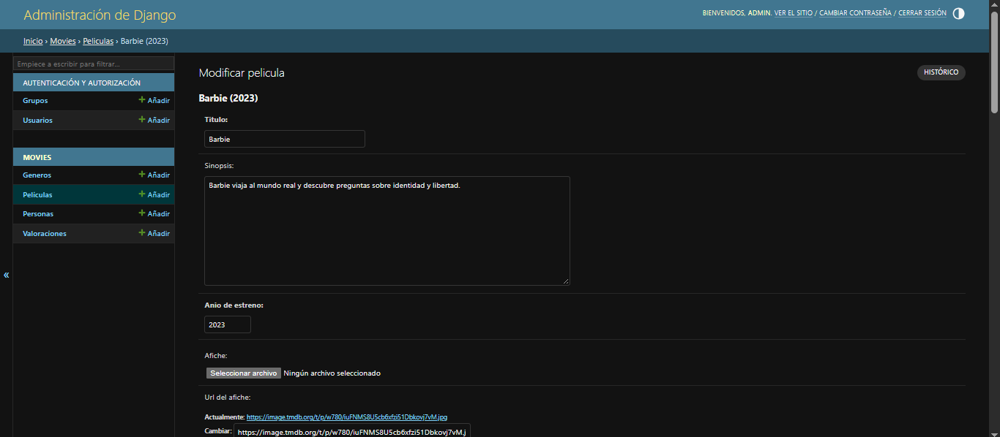

#### 04. Valoraciones en linea

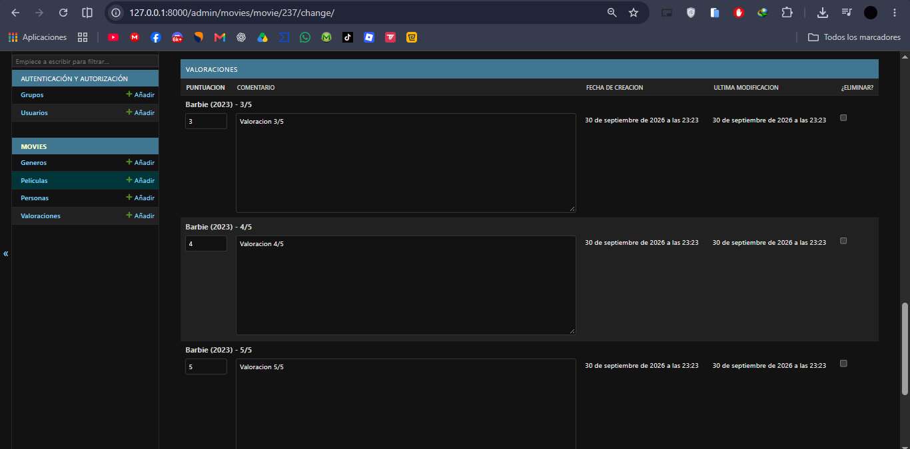

#### 05. Auditoria solo lectura

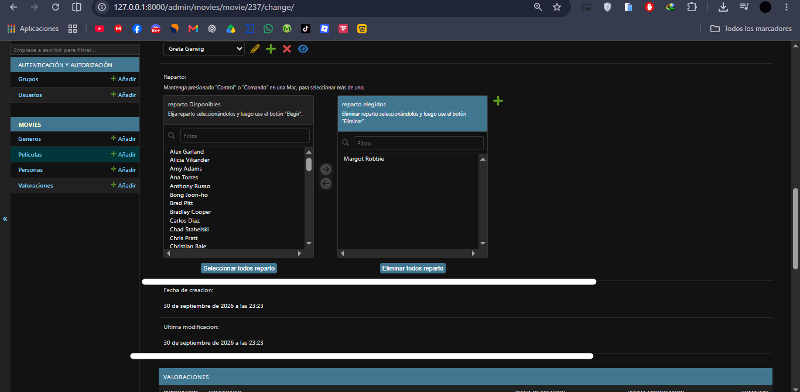

#### 06. Panel del editor

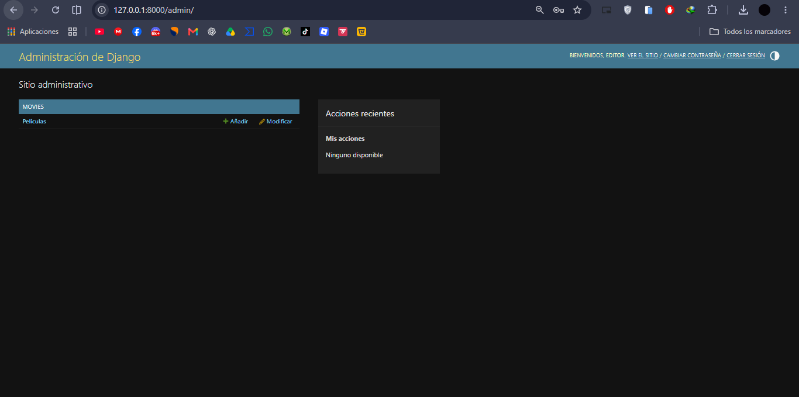

#### 07. Editor sin permiso para eliminar

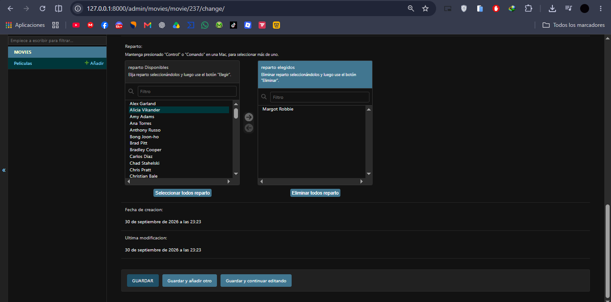

#### 08. Vista publica principal

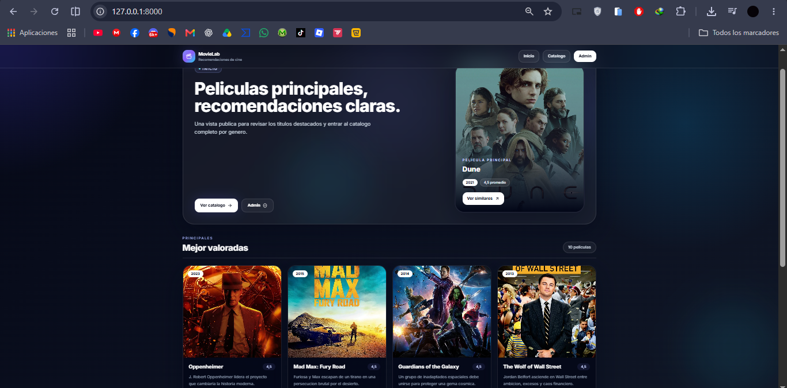

#### 09. Vista publica de recomendaciones

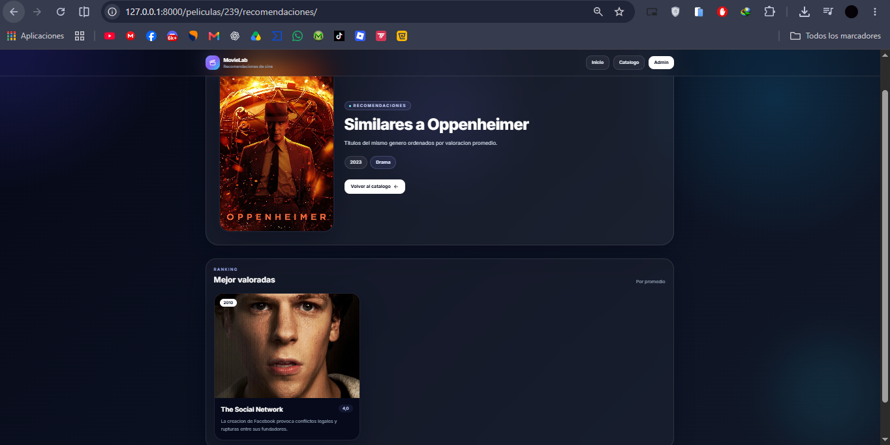

#### 10. Catalogo por generos

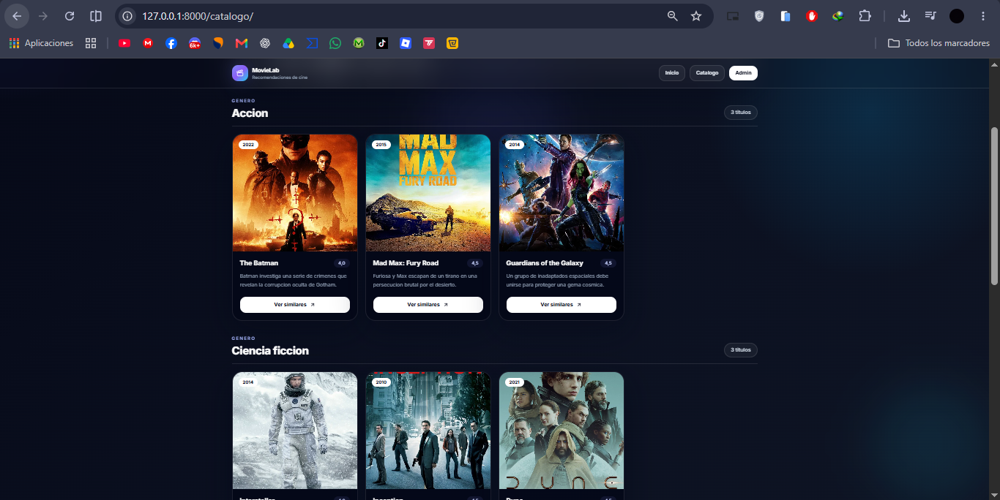

En el documento de entrega, agregar una comparacion breve:

- El superusuario administra todos los modelos y todas las operaciones.
- El usuario editor pertenece al grupo `editores`.
- El grupo `editores` tiene permisos para agregar y cambiar peliculas.
- El grupo `editores` no tiene permiso para eliminar peliculas.
- El panel permite gestionar datos sin escribir vistas CRUD, pero la recomendacion publica necesita una vista propia.

## Observaciones del laboratorio

- El administrador permite gestionar los modelos relacionados sin escribir vistas CRUD manuales.
- La personalizacion con `ModelAdmin` mejora el uso del panel porque agrega columnas relevantes, filtros y busqueda.
- Las valoraciones en linea reducen pasos al crear o editar una pelicula.
- Los campos de auditoria se protegen marcandolos como solo lectura.
- Los grupos y permisos permiten diferenciar responsabilidades entre administradores y editores.
- La vista publica de recomendaciones requiere codigo propio porque responde a una regla que no existe automaticamente en el panel.

## Rubrica cubierta

1. Configura el administrador para gestionar los modelos relacionados. Todos los modelos estan registrados y las valoraciones se editan en linea dentro de peliculas.
2. Personaliza listado, filtros y busqueda con `ModelAdmin`. El listado muestra columnas utiles, hay filtros por genero/anio y busqueda por titulo/nombre.
3. Administra el acceso con usuarios, grupos y permisos. Existe el grupo `editores`, un usuario dentro del grupo y permisos limitados para agregar/cambiar peliculas sin eliminar.
4. Entrega el repositorio con configuracion y observaciones. Este README documenta instalacion, ejecucion, roles, permisos, vista publica, capturas requeridas y observaciones.

## Entrega final

Antes de entregar:

1. Ejecutar `python manage.py check`.
2. Ejecutar `python manage.py makemigrations --check --dry-run`.
3. Probar el panel con `admin` y `editor`.
4. Tomar las capturas solicitadas.
5. Subir el proyecto al repositorio del equipo.
6. Subir el entregable con capturas y observaciones al campus virtual.

## Verificacion

Comprobar que el proyecto no tiene errores:

```powershell
python manage.py check
```

Comprobar que no hay migraciones pendientes:

```powershell
python manage.py makemigrations --check --dry-run
```

---

## Continuación: portal de noticias

La aplicación `news` desarrolla la sesión de plantillas dentro del mismo proyecto `config`. La sección de noticias se abre en `http://127.0.0.1:8000/noticias/`. Películas y noticias comparten la identidad **Nexo**, el navbar, los colores, la tipografía y el pie de página. El acceso **Admin** es el mismo en ambas secciones y lleva al administrador de todas las entidades.

### Revisión de los 13 puntos de la sesión

| Punto | Comprobación | Estado |
| --- | --- | --- |
| 1 | Proyecto `config`, Pillow instalado y `news.apps.NewsConfig` en `INSTALLED_APPS`. | Implementado |
| 2 | Directorio `templates/`, configuración de estáticos y medios; medios servidos en desarrollo. | Verificado |
| 3 | `Article`, `Category` y `Author`, imágenes, publicación, relaciones, migraciones y superusuario. | Verificado |
| 4 | Base compartida y base de noticias con bloques de título, contenido y barra lateral. | Verificado |
| 5 | `_article_card.html` incluido tanto en portada como en categoría. | Verificado |
| 6 | Portada con `for`, `empty`, `date` y `truncatewords` mediante el fragmento compartido. | Verificado |
| 7 | Detalle heredado con imagen, autor y categorías. | Verificado |
| 8 | Listado de categoría con la misma tarjeta reutilizada. | Verificado |
| 9 | Rutas `news:home`, `news:detail` y `news:category`; enlaces internos con ``. | Verificado |
| 10 | CSS con `` / ``; estilos e imágenes locales comprobados. | Verificado y capturado |
| 11 | Los tres administradores personalizados; seis noticias dadas de alta desde el panel y publicadas en tres categorías. | Verificado mediante formularios de Admin y su historial |
| 12 | Etiqueta HTML guardada desde el admin, mostrada como texto y explicada en este documento. | Verificado y capturado |
| 13 | Publicar esta continuación en el repositorio y entregar capturas, código y casos de prueba al campus. | Código y evidencias incluidos en este repositorio; entrega al campus pendiente |

**Detalle del punto 11:** los datos se prepararon inicialmente con `seed_news` y después se registraron las seis noticias mediante el formulario **Añadir noticia** del administrador, usando Chromium automatizado. En cada alta se subió la imagen y se seleccionaron autor, categorías y fecha. Se comprobaron las seis entradas de creación en el historial de Django y sus páginas públicas. Los ejemplos iniciales se sustituyeron por esas altas, conservando contenido y direcciones públicas: quedan seis noticias, tres categorías y diez películas. La captura `news_10_altas_admin.png` muestra el listado y las altas. `seed_news` se conserva para reconstruir los ejemplos después de clonar, sin depender de la base de datos local.

La revisión técnica pasó con `check`, `makemigrations --check --dry-run`, `migrate --check` y las 18 pruebas del proyecto. Las diez capturas de noticias están incluidas al final. La calificación depende de la revisión docente y de completar la entrega.

### Ejecutar la continuación

Desde la carpeta que contiene `manage.py`, con el entorno virtual activado:

```powershell
python -m pip install -r requirements.txt
python manage.py migrate
python manage.py seed_news
python manage.py runserver
```

`seed_news` carga seis noticias reales, tres categorías y la autoría interna **Redacción Nexo**, con imágenes destacadas locales. Convierte los seis ejemplos ficticios anteriores en noticias reales. Después de esa conversión, se puede ejecutar nuevamente sin duplicar las noticias ni sobrescribir sus textos editados desde el panel.

Las imágenes de referencia están incluidas en `news/data/images/`. Si faltan esos archivos, se pueden recuperar desde sus fuentes verificadas:

```powershell
python manage.py fetch_news_images
python manage.py seed_news
```

Si acabas de clonar el repositorio y la base está vacía, prepara **ambos laboratorios** antes de iniciar el servidor:

```powershell
python manage.py migrate
python manage.py seed_lab
python manage.py seed_news
python manage.py runserver
```

Las migraciones crean las tablas, pero no cargan películas ni noticias. `seed_lab` carga las diez películas, sus géneros, valoraciones y el usuario editor; `seed_news` carga las seis noticias. El comando `seed_lab` reemplaza los registros de películas existentes, por lo que esta secuencia está indicada para una base nueva.

Si no existe el usuario `admin`, crea un superusuario local con `admin` / `Admin12345`. Si ya existe, conserva su contraseña y permisos. Para crear otro superusuario con credenciales propias:

```powershell
python manage.py createsuperuser
```

### Páginas y rutas

| Página | Nombre de ruta | Dirección |
| --- | --- | --- |
| Portada | `news:home` | `/noticias/` |
| Detalle | `news:detail` | `/noticias/articulo/<slug>/` |
| Categoría | `news:category` | `/noticias/categoria/<slug>/` |
| Administrador | `admin:index` | `/admin/` |

Ejemplos para abrir después de ejecutar `seed_news`:

- Portada: `http://127.0.0.1:8000/noticias/`.
- Tecnología: `http://127.0.0.1:8000/noticias/categoria/tecnologia/`.
- Cultura: `http://127.0.0.1:8000/noticias/categoria/cultura/`.
- Ciudades: `http://127.0.0.1:8000/noticias/categoria/ciudades/`.
- Ejemplo de detalle: `http://127.0.0.1:8000/noticias/articulo/webb-primer-campo-profundo/`.

Los enlaces internos de las plantillas de noticias usan ``. Las imágenes usan la URL del `ImageField`; el CSS se carga con `` y ``.

### Modelos y relaciones

- `Article`: título, slug, resumen, cuerpo, imagen destacada, fecha de publicación, autor, categorías, fuente original, crédito de imagen y fechas de auditoría.
- `Category`: nombre, slug y descripción.
- `Author`: nombre, biografía y fotografía opcional.
- Una noticia tiene un autor mediante clave foránea; no se permite borrar un autor mientras tenga noticias asociadas.
- Una noticia puede pertenecer a varias categorías mediante una relación muchos a muchos.
- Todos los modelos incluyen `Meta` y `__str__`.
- Las noticias con fecha de publicación futura no se muestran todavía en el portal.

### Estructura de plantillas y recursos

```text
templates/
├── base.html          # Layout compartido de películas y noticias
└── news/
    ├── base.html
    ├── _article_card.html
    ├── _sidebar.html
    ├── _related_articles.html
    ├── home.html
    ├── detail.html
    └── category.html
news/
├── models.py
├── admin.py
├── views.py
├── urls.py
├── tests.py
├── migrations/
├── data/stories.py       # Resúmenes, fechas, fuentes y créditos
├── data/images/         # Seis imágenes reales descargadas
├── management/commands/fetch_news_images.py
├── management/commands/seed_news.py
└── static/news/css/style.css
media/
└── news/articles/    # Copias de imágenes reales o archivos subidos desde el admin
```

`TEMPLATES['DIRS']` incluye `BASE_DIR / 'templates'`. `STATIC_URL` y `STATIC_ROOT` configuran estáticos; Django encuentra la hoja de estilos dentro de `news/static/`. `MEDIA_URL` y `MEDIA_ROOT` configuran las imágenes subidas, servidas en desarrollo desde `config/urls.py` cuando `DEBUG=True`.

`templates/base.html` contiene el layout general y el navbar compartido. `news/base.html` hereda de él, organiza el bloque `content` y añade los bloques `news_content` y `sidebar`. Las tres páginas de noticias heredan de esa base con `` y rellenan `title` y `news_content`. Portada y categoría incluyen la misma tarjeta con ``, evitando repetir el marcado. La barra lateral se comparte mediante `_sidebar.html`.

La hoja local `news/css/style.css` adapta las tarjetas y la barra lateral a la paleta oscura de Nexo. Sus reglas están limitadas a `.news-portal`, para no cambiar el navbar ni los estilos de películas.

Las plantillas utilizan `for`, `empty`, `if`, `date`, `truncatewords` y `linebreaksbr`. Las consultas y la selección de noticias publicadas se resuelven en las vistas; las plantillas presentan esos resultados.

### Administrar y cargar contenido desde el panel

La sesión pide dar de alta seis noticias en tres categorías **desde el administrador**. El comando `seed_news` prepara ejemplos reproducibles, pero la comprobación manual del panel debe incluirse en el entregable.

Para hacer la carga desde cero, aplicar las migraciones, crear un superusuario y entrar al admin antes de ejecutar `seed_news`:

1. En **Portal de noticias → Categorías**, crear Tecnología, Cultura y Ciudades, con sus identificadores.
2. En **Autores**, registrar los autores de las noticias.
3. En **Noticias → Añadir**, completar título, resumen, cuerpo, imagen, autor y categorías.
4. Usar una fecha de publicación actual o pasada y guardar.
5. Repetir hasta tener seis noticias; por ejemplo, dos por categoría.
6. Abrir la portada y los listados por categoría para verificar lo registrado.

Si ya cargaste los ejemplos, edita una noticia desde el panel y verifica el cambio en su página pública. El contenido viene de la base de datos, no está escrito dentro de las plantillas.

Los tres modelos tienen `list_display`, `list_filter` y `search_fields`. En noticias también se configura `date_hierarchy`, selector de categorías y campos de auditoría de solo lectura.

Las seis imágenes son **imágenes reales procedentes de las publicaciones o páginas oficiales enlazadas**. Pillow comprueba los archivos y los convierte a JPEG sin aumentar artificialmente su resolución. Se conservan copias en `news/data/images/` para poder reconstruir los datos sin conexión. Al ejecutar `seed_news`, las imágenes pasan a `media/news/articles/` y se sirven localmente. `media/`, `db.sqlite3` y `staticfiles/` están ignorados en Git.

### Noticias reales y fuentes

Los textos son resúmenes propios en español; no son reproducciones completas ni se atribuyen a periodistas ficticios. Las fechas mostradas corresponden al día de publicación de las fuentes. La selección contiene noticias de distintas fechas, no una actualización automática de últimas noticias.

| Categoría | Noticia | Fecha | Fuente |
| --- | --- | --- | --- |
| Tecnología | Primer campo profundo del James Webb | 12/07/2022 | [NASA](https://science.nasa.gov/missions/webb/nasas-webb-delivers-deepest-infrared-image-of-universe-yet/) |
| Tecnología | Pintura sensible a la presión en un ala de prueba | 02/10/2026 | [NASA](https://www.nasa.gov/centers-and-facilities/langley/nasa-model-wing-lights-up-during-first-pressure-sensitive-paint-tests/) |
| Cultura | Rabat, Capital Mundial del Libro 2026 | 08/10/2024 | [UNESCO](https://www.unesco.org/en/articles/unesco-names-rabat-world-book-capital-2026) |
| Cultura | Nobel de Literatura 2024 para Han Kang | 10/10/2024 | [NobelPrize.org](https://www.nobelprize.org/prizes/literature/2024/press-release/) |
| Ciudades | 55 nuevas Ciudades Creativas | 31/10/2023 | [UNESCO](https://www.unesco.org/en/articles/55-new-cities-join-unesco-creative-cities-network-world-cities-day) |
| Ciudades | Apertura del tramo central de la Elizabeth line | 24/05/2022 | [Transport for London](https://tfl.gov.uk/info-for/media/press-releases/2022/may/all-aboard-the-transformational-elizabeth-line) |

El detalle muestra un enlace a la **fuente original** y el crédito de la imagen. Las imágenes de NASA corresponden a las observaciones y ensayos descritos; la de Han Kang muestra libros de la escritora; las de UNESCO y TfL son imágenes de contexto publicadas por esas instituciones. Los créditos y las URLs están registrados en `news/data/stories.py` y se pueden editar en el admin.

### Caso de prueba: escapado automático

Para comprobar el requisito desde el panel, abre cualquier noticia, conserva una copia de su cuerpo y añade temporalmente al final:

```html
<strong>Este texto no debe aparecer en negrita.</strong>
```

**Resultado esperado y comprobado:** en la página de detalle se ven literalmente las etiquetas `<strong>` y `</strong>`. Ese texto no se vuelve negrita.

Toma la captura comparando el cuerpo del admin con el detalle público y luego restaura el contenido original. Así el portal mantiene sus seis noticias reales sin dejar la prueba técnica como una noticia adicional. Las pruebas automatizadas ejecutan este caso en una base de datos de prueba independiente.

**Por qué:** Django Templates tiene escapado automático activado. Los caracteres `<` y `>` se convierten en `&lt;` y `&gt;` dentro del HTML de respuesta. El navegador los muestra como texto. `{{ article.body|linebreaksbr }}` conserva los saltos de línea sin interpretar las etiquetas introducidas por el usuario. No se usa `safe` ni se desactiva `autoescape`.

La prueba automatizada también comprueba que una etiqueta `<script>` guardada en el cuerpo se escape y no aparezca como un script ejecutable.

### Verificación y casos de prueba

```powershell
python manage.py check
python manage.py makemigrations --check --dry-run
python manage.py migrate --check
python manage.py test news --verbosity 2
```

La suite de noticias incluye 14 pruebas:

| Caso | Qué verifica |
| --- | --- |
| Herencia y fragmentos | La portada usa la base y la tarjeta compartida. |
| Escapado automático | HTML guardado como texto; saltos de línea conservados. |
| Fuentes y créditos | Los enlaces de fuente e imagen se muestran en el detalle. |
| Listado por categoría | Filtrado correcto y reutilización de la tarjeta. |
| Lectura relacionada | Noticias del mismo tema, sin repetir la noticia abierta ni incluir otras categorías. |
| Publicación futura | La noticia no se muestra antes de su fecha. |
| Portada vacía | Mensaje diseñado mediante `empty`. |
| Direcciones inexistentes | Respuesta 404 para artículo y categoría. |
| Edición desde el admin | Un cambio real en el formulario se ve en el portal. |
| Panel de noticias | Listados de las tres entidades con búsqueda. |
| Protección del autor | No se borra un autor asociado a una noticia. |
| Estáticos | Django encuentra la hoja de estilos. |
| Datos reproducibles | Seis noticias, tres categorías e imágenes válidas; repetir el comando conserva cambios. |
| Conversión de ejemplos | Convierte los datos ficticios conservando las noticias propias y las películas. |

Además de las pruebas, se comprobó por HTTP que la portada, las tres categorías, los seis detalles, la hoja de estilos y las seis imágenes responden correctamente en el servidor de desarrollo.

### Capturas del portal de noticias

Las siguientes diez capturas se tomaron con Chromium sobre el proyecto en ejecución y están guardadas en `img/`. Corresponden a la continuación de noticias; las capturas del laboratorio de películas se conservan en su sección anterior.

| Archivo | Qué muestra |
| --- | --- |
| `news_01_portada.png` | Portada con las seis noticias, fechas y resúmenes. |
| `news_02_detalle.png` | Imagen destacada, autor, fecha, cuerpo y categorías de una noticia. |
| `news_03_categoria.png` | Categoría con sus noticias y tarjetas reutilizadas. |
| `news_04_admin.png` | Los tres modelos de noticias registrados en el admin. |
| `news_05_listado_admin.png` | Columnas, filtros y búsqueda de noticias. |
| `news_06_edicion.png` | Una noticia editada en el admin y el mismo cambio en el portal. |
| `news_07_escapado.png` | Cuerpo en el admin con `<strong>…</strong>` y detalle donde se ven las etiquetas como texto. |
| `news_08_recursos.png` | CSS e imagen local abiertos en Chromium; se verificaron sus respuestas HTTP 200 y tipos de contenido. |
| `news_09_sin_resultados.png` | Una categoría creada en admin sin noticias, mostrando el estado vacío. |
| `news_10_altas_admin.png` | Listado de las seis noticias y el historial de sus altas desde el administrador. |

#### 01. Portada de noticias

Muestra las seis publicaciones, las categorías, los resúmenes y sus fechas.

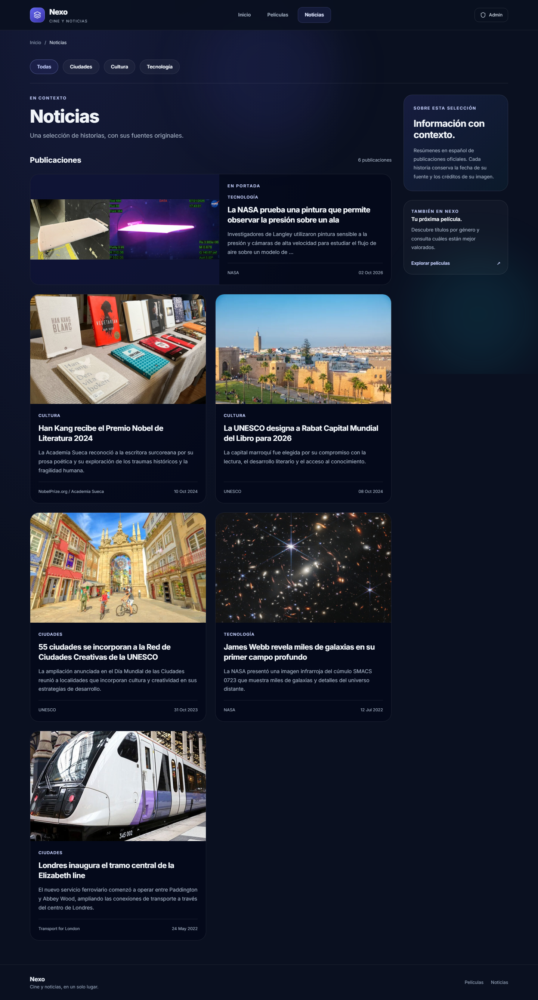

#### 02. Detalle de una noticia

Incluye imagen real, autor, fecha, cuerpo, categorías, crédito de imagen y enlace a la fuente original.

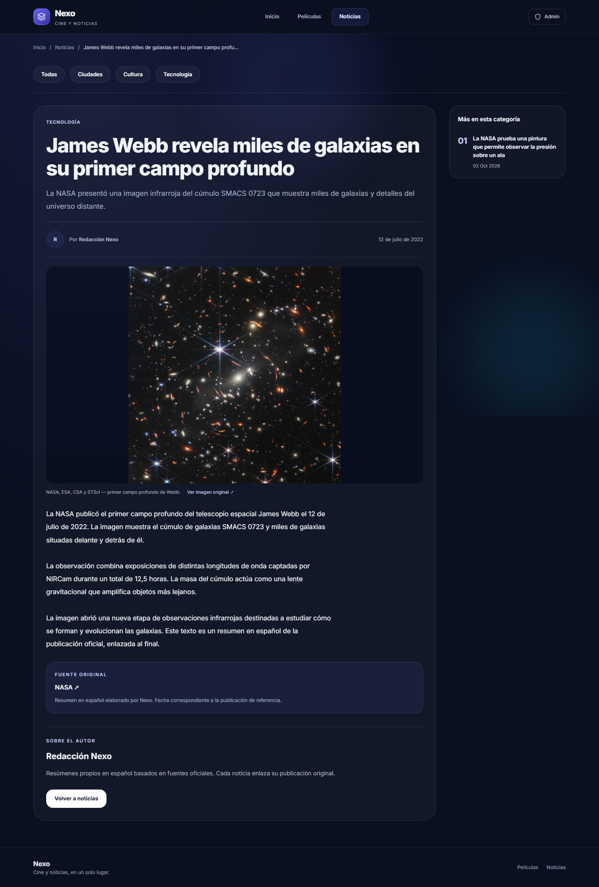

#### 03. Listado por categoría

La sección Tecnología reutiliza `_article_card.html` para mostrar sus dos noticias.

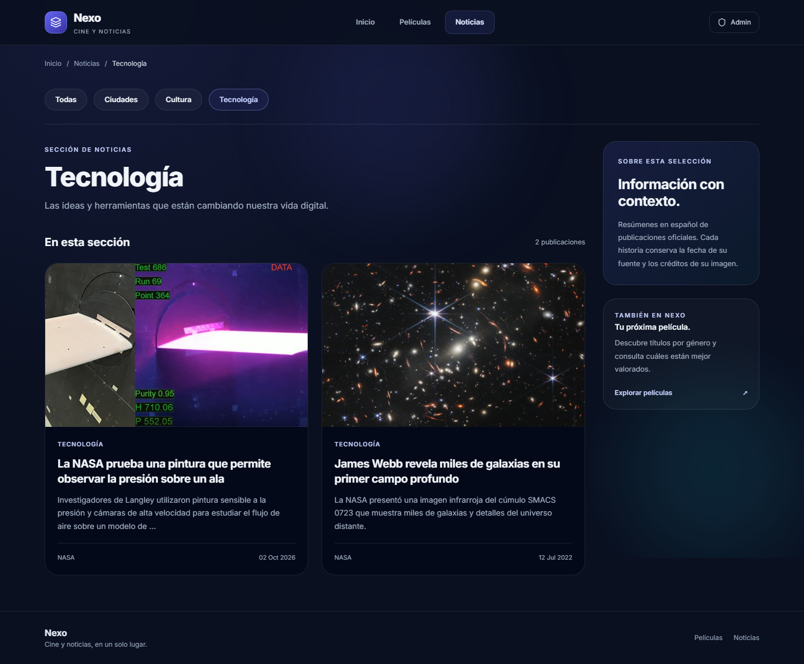

#### 04. Modelos registrados en el administrador

En **Portal de noticias** aparecen Autores, Categorías y Noticias, junto con las entidades del laboratorio anterior.

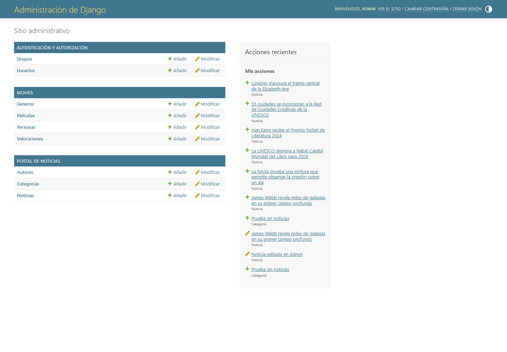

#### 05. Listado personalizado del administrador

Muestra las columnas, la búsqueda, los filtros y la navegación por fecha de publicación.

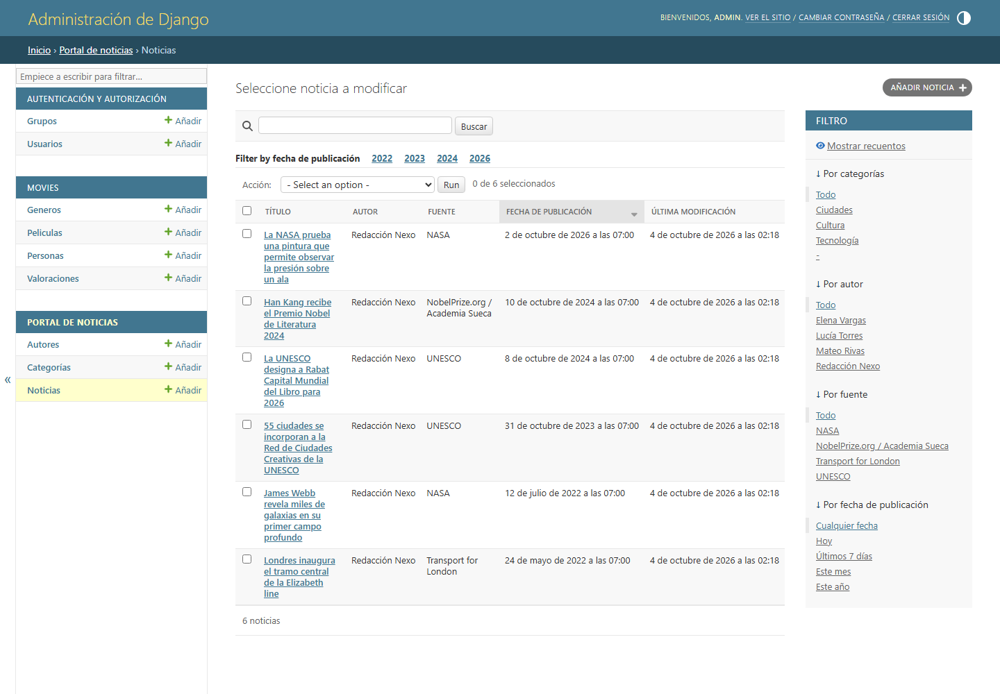

#### 06. Edición desde el administrador y publicación del cambio

Se guardó temporalmente el título **Noticia editada en Admin** desde el formulario del panel. La comparación reúne dos capturas reales: el formulario guardado y el mismo cambio en el sitio público. Después se restauró el título original.

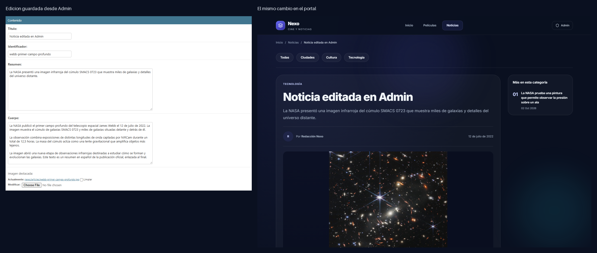

#### 07. Escapado automático de HTML

Se añadió temporalmente `<strong>Este texto no debe aparecer en negrita.</strong>` al cuerpo desde el admin. La página mostró literalmente las etiquetas, sin interpretarlas como formato. La comparación reúne las capturas del campo y del cuerpo publicado. Al terminar se restauró el texto original.

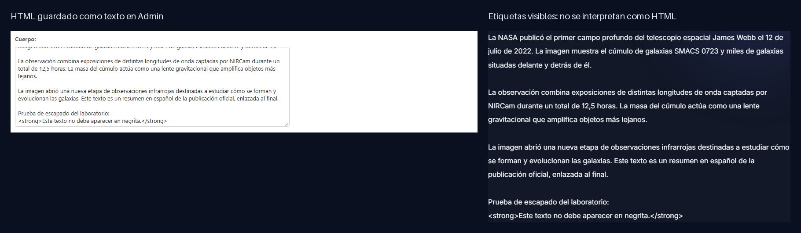

#### 08. Archivos estáticos y medios

Se abrieron directamente la hoja de estilos y una imagen local en Chromium. La captura combina ambas vistas; los encabezados indican las respuestas HTTP 200 comprobadas durante las solicitudes. También se verificó `text/css` para la hoja y un tipo `image/…` para la imagen.

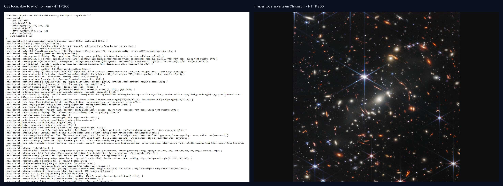

#### 09. Estado sin resultados

Se creó desde el admin la categoría temporal **Prueba sin noticias**, sin artículos asociados. El portal mostró el caso `empty` y una acción para volver a la portada. La categoría se eliminó después de tomar la captura, conservando las tres categorías originales.

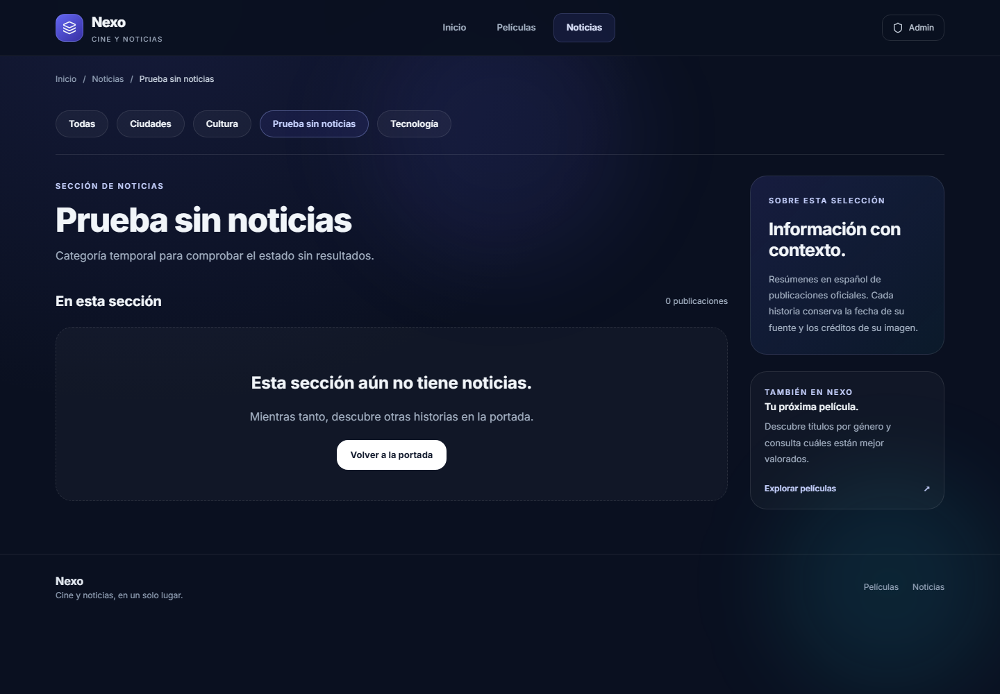

#### 10. Seis altas realizadas desde Admin

Se rellenaron y guardaron los seis formularios de **Añadir noticia** desde el administrador, con sus imágenes, autores, categorías y fechas. La imagen reúne capturas del listado final de seis noticias y del historial de acciones del administrador, donde aparecen las altas. Se comprobó cada noticia en el portal después de guardarla.

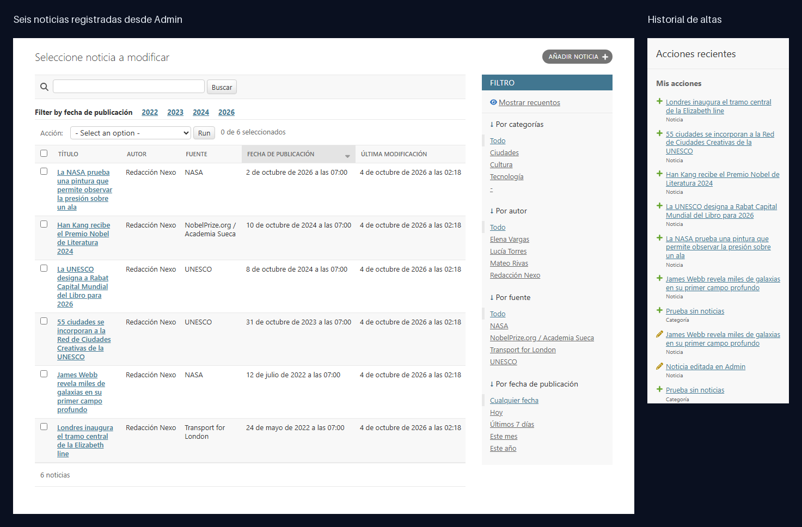

### Observaciones y entrega de la continuación

- La herencia centraliza la estructura del portal; una modificación en la base se refleja en las tres páginas.
- La tarjeta compartida evita que portada y categoría terminen con marcado distinto o duplicado.
- Los filtros de plantilla formatean fechas y recortan resúmenes; los datos vienen del administrador.
- La imagen destacada usa `ImageField` y el sistema de medios de Django, con Pillow instalado.
- El escapado automático permite mostrar texto introducido por el usuario sin convertirlo en HTML ejecutable.

El código, las plantillas, los estilos, las imágenes de referencia, los casos de prueba y las capturas de esta continuación están incluidos en este repositorio: [Desarrollo-de-Aplicaciones-Empresariales-LAB07](https://github.com/leonel-m4/Desarrollo-de-Aplicaciones-Empresariales-LAB07). Para el campus virtual, entregar el enlace del repositorio y el documento con capturas, estructura de plantillas, observaciones y casos de prueba. La entrega al campus virtual queda pendiente.
