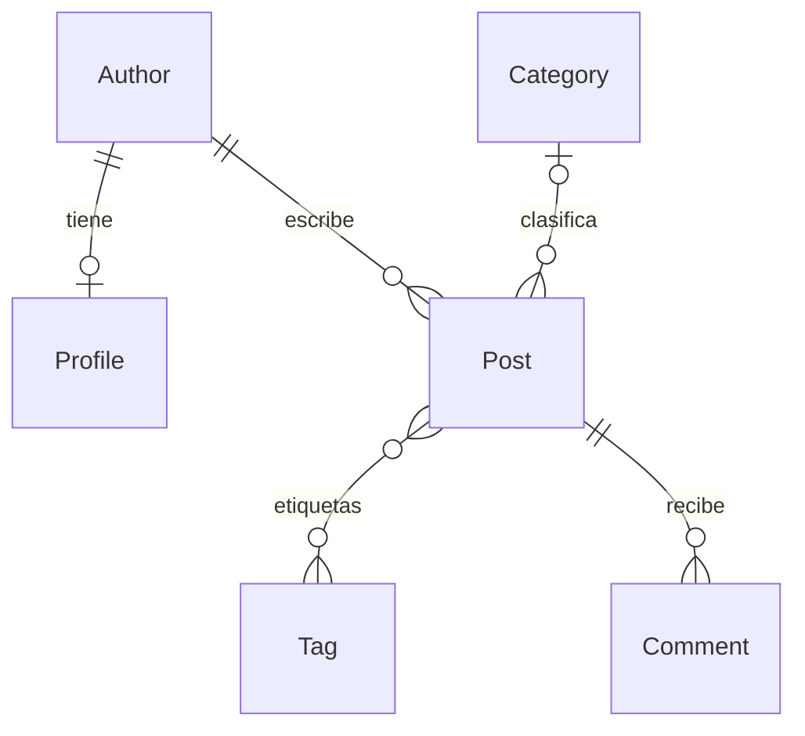

# LAB07 — ORM con IA: evidencias y entregable

Repositorio: [leonel-m4/Desarrollo-de-Aplicaciones-Empresariales-LAB07](https://github.com/leonel-m4/Desarrollo-de-Aplicaciones-Empresariales-LAB07).

## Alcance y trabajo individual

El alumno decidió reservar **q1–q4 para resolverlas sin IA**. Esas funciones permanecen sin implementar; sus resultados e intentos deben completarse personalmente. No se presenta este documento como evidencia de que esa parte ya esté resuelta.

Este documento registra resultados reales de ejecución y señala la asistencia de IA. El dibujo a mano, los intentos individuales y la entrega al campus no se sustituyen por una ejecución automática. La comparación adicional del paso 8 se omite porque no se ha confirmado autorización docente.

## 1–2. Instalación y datos

Se utiliza Python 3.13, un entorno `.venv` propio de LAB07 y las dependencias de `requirements.txt`. La base SQLite y el entorno virtual están excluidos de Git.

```powershell
py -m venv .venv
.\.venv\Scripts\python.exe -m pip install -r requirements.txt
.\.venv\Scripts\python.exe manage.py migrate
.\.venv\Scripts\python.exe manage.py seed_blog
.\.venv\Scripts\python.exe manage.py shell
```

En la consola de Django, las operaciones de conteo son:

```python
from blog.models import Author, Post, Comment
Author.objects.count()
Post.objects.count()
Comment.objects.count()
```

Resultado del conjunto fijo: **4 autores, 15 artículos y 23 comentarios**. Hay **11 artículos publicados** y 4 borradores. La medición de la base local está en [portada_antes.json](evidencias/portada_antes.json).

## 3. Relaciones: referencia para el dibujo a mano

El siguiente esquema es una referencia generada con asistencia de IA, **no un dibujo a mano realizado por el alumno**. Adjuntar la fotografía del diagrama propio antes de entregar.



- Cada `Profile` pertenece a un único `Author`; un autor puede existir sin perfil. `country` está en `Profile`, no en `Author`.
- Cada `Post` tiene un autor obligatorio. Borrar el autor elimina sus artículos y los comentarios de esos artículos (`CASCADE`).
- La categoría del artículo es opcional (`null=True`, `blank=True`). Borrar una categoría conserva sus artículos, dejando la relación en `NULL` (`SET_NULL`).
- `Post.tags` es muchos a muchos y admite artículos sin etiquetas.
- Cada comentario pertenece a un artículo (`CASCADE`). `Comment.author_name` es texto, **no** una relación con `Author`.

## 4–5. Consultas del equipo e intentos

| Pregunta | Estado | Intentos individuales |
| --- | --- | --- |
| q1 | Pendiente del alumno, sin IA | Por completar |
| q2 | Pendiente del alumno, sin IA | Por completar |
| q3 | Pendiente del alumno, sin IA | Por completar |
| q4 | Pendiente del alumno, sin IA | Por completar |
| q5 | Correcta, 1 consulta | 1 versión asistida validada; no se atribuyen intentos humanos |
| q6 | Correcta, 1 consulta | 1 versión asistida validada; no se atribuyen intentos humanos |
| q7 | Correcta, 1 consulta | 1 versión asistida validada; no se atribuyen intentos humanos |
| q8 | Correcta, 1 consulta | 1 versión asistida validada; no se atribuyen intentos humanos |

Anotar los intentos reales de q1–q4, incluyendo las versiones fallidas y sus mensajes. Si alguna no se resuelve, documentar lo probado; no sustituirlo por una respuesta generada por IA.

Las implementaciones asistidas q5–q8 devolvieron QuerySets y aprobaron la primera versión comprobada. Las reejecuciones para evidencias y regresión no representan nuevos intentos de resolución. La salida está en [duel_equipo.txt](evidencias/duel_equipo.txt), su SQL en [consultas_equipo.json](evidencias/consultas_equipo.json) y las pruebas en [test_consultas_equipo.txt](evidencias/test_consultas_equipo.txt).

- q5 cuenta identificadores distintos de comentarios y etiquetas, evitando el producto de los JOIN, y usa un desempate por clave primaria.
- q6 sigue la relación `author__profile__country`, que sí existe en el modelo.
- q7 sigue `post__category__name`, sin excluir artículos solo por no estar publicados.
- q8 cuenta únicamente artículos publicados y selecciona los autores con cero: incluye a quienes solo tienen borradores y a quienes no tienen ningún artículo.

El duelo todavía muestra **4 de 8 correctas** porque q1–q4 están pendientes, no porque las cuatro implementaciones asistidas hayan fallado. La suite permite ese trabajo manual pendiente, pero exige que q5–q8 sean correctas y eficientes. Cuando el alumno complete una de q1–q4, también deberá pasar su comprobación; una suite verde no acredita por sí sola que haya terminado el duelo.

## 6–7. Comparación con las respuestas de IA incluidas

Consultar esta sección **después de intentar personalmente q1–q4**. Se ejecutó `python manage.py duel --source ai` contra el conjunto fijo. Son las respuestas preexistentes de `blog/duel/ai_answers.py`, no ocho consultas nuevas solicitadas a este asistente.

| Pregunta | Veredicto | Consultas | Clasificación y evidencia |
| --- | --- | --- | --- |
| q1 | Correcta | 1 | Resultado esperado. |
| q2 | Correcta | 1 | Resultado esperado. |
| q3 | Resultado distinto | 1 | **Borde:** usa límites estrictos, excluyendo 01/03/2026 y 31/05/2026. Faltan dos artículos. |
| q4 | Correcta pero cara | 16 | **N+1:** obtiene 15 artículos y ejecuta un `COUNT` de comentarios por cada uno, filtrando en Python. |
| q5 | Resultado distinto | 1 | **Conteos multiplicados:** los JOIN de comentarios y etiquetas multiplican filas; devuelve `(18,18)`, `(12,12)`, `(8,8)` en lugar de los conteos esperados. |
| q6 | Error | 0 | **Campo inventado:** `author__country` no existe; el país pertenece al perfil. Django lanza `FieldError` antes de ejecutar SQL. |
| q7 | Correcta | 1 | Resultado esperado. |
| q8 | Resultado distinto | 1 | **Significado:** tener un borrador no significa no haber publicado nunca; además, el JOIN omite al autor sin artículos y repite filas. |

Salida original: [duel_ia.txt](evidencias/duel_ia.txt). Veredictos, diferencias y **SQL realmente ejecutado**: [comparacion_ia.json](evidencias/comparacion_ia.json). q6 no tiene SQL porque la construcción de la consulta falla.

## 8. Comparación adicional con un asistente autorizado

**Omitida:** no consta autorización docente para pedir y comparar ocho consultas nuevas. La implementación asistida parcial debe declararse en la tabla de uso de IA, sin presentarla como este paso opcional completo.

## 9–10. Línea base del problema N+1

La prueba `test_front_page_runs_two_queries` falla antes del arreglo con **`23 != 2 : 23 queries executed, 2 expected`**. La salida completa, incluido el listado de las 23 consultas capturadas por Django, está en [test_portada_antes.txt](evidencias/test_portada_antes.txt).

Las 23 consultas proceden de **1 consulta de artículos + 11 consultas de autor + 11 consultas de etiquetas**. La plantilla accede a `post.author.name` y a `post.tags.all` para cada uno de los 11 artículos publicados. Aunque varios comparten autor, cada objeto `Post` carga su relación por separado.

Con `N` artículos publicados, esta implementación ejecuta `1 + 2N` consultas. No son 15 autores ni 15 listas de etiquetas: los cuatro borradores no se renderizan en la portada.

## 11. Optimización y suite completa

Pendiente de aplicar y registrar el arreglo. Se conservará la evidencia anterior para comparar la ejecución de la misma página antes y después.

## 12–14. Intenciones, comentario hostil y aprobación

Pendientes de registrar las cuatro intenciones del README, el borrado autorizado del artículo 5, la restauración y el rechazo de un plan cuyo conjunto de comentarios cambió.

## 15. Uso de IA y entrega

| Uso | Solicitado | Respuesta / decisión |
| --- | --- | --- |
| q1–q4 | No se solicitó resolverlas | Se dejan para el trabajo individual del alumno. |
| q5–q8 | Implementar las otras consultas con ayuda declarada | Se aceptan tras verificar resultados y presupuesto: correctas, una consulta por pregunta. |
| Respuestas preexistentes | Ejecutarlas y clasificar sus fallos | Se aceptan q1, q2 y q7 por su veredicto; q3, q5, q6 y q8 se rechazan. q4 se rechaza como solución eficiente pese a devolver el resultado correcto. |
| Esquema y evidencias | Preparar una referencia y capturar resultados reales | Se utiliza como apoyo; no acredita un dibujo manual ni intentos personales. |
| Paso 8 | No solicitado sin autorización docente | Omitido. |

**Pendiente del alumno:** resolver q1–q4, registrar sus intentos, adjuntar el dibujo a mano, revisar los usos de IA con el docente y subir el entregable al campus dentro del plazo. La publicación en GitHub no equivale a entregar en el campus.
